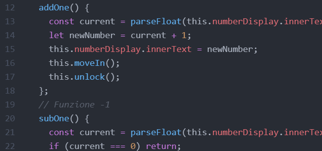
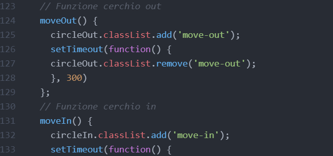
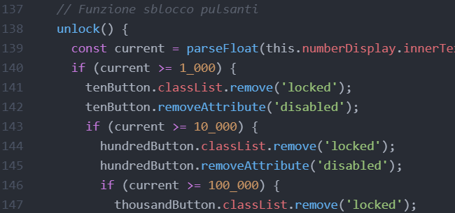

<!-- Intestazione -->

<h1>The Infinite Counter</h1>

<!-- Sommario -->

  
Table of Contents

  <ol>
    <li><a href="#about-the-project">About the project</a></li>
    <li><a href="#built-with">Built with</a></li>
    <li><a href="#javascript components">JavaScript components</a>
      <ol>
        <li><a href="#add-functions">Add functions</a></li>
        <li><a href="#move-function">Move function</a></li>
        <li><a href="#unlock-function">Unlock function</a></li>
      </ol>
    </li>
  </ol>

 

<!-- Informazioni sul progetto -->
## About the project

The main function of the project is to be a counter. To make the user experience more interactive, several features have been added. There are five buttons that unlock at gradual levels of the counter and allow you to add larger quantities to it. There is also a reset button that allows you to reset the counter with a single click. 

(<a href="#top">back to top</a>)

 

<!-- Coustruito con -->
## Built with
* [Bootstrap](https://getbootstrap.com)
* [JavaScript](https://www.javascript.com/)

(<a href="#top">back to top</a>)

 

<!-- Componenti JavaScript -->
## JavaScript components
### Add functions

For each button a function has been created that adds (or subtracts) a certain quantity to the counter. Each add function then calls two other functions. The <em>moveIn()</em> function (or in the subtraction case <em>moveOut()</em>) and the <em>unlock()</em> function.

### Move function

Adding the class <em>move-in</em> (or in the subtraction case <em>move-out</em>) it allows you to create a sort of animation of a small circle entering or exiting the main circle

### Unlock function

The function checks the current level of the counter and unlocks the additional buttons that allow you to add more quantities.

(<a href="#top">back to top</a>)

 
