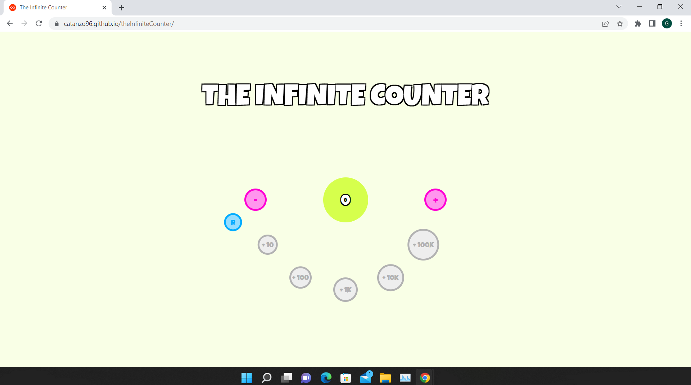

<!-- Intestazione -->

<h1>The Infinite Counter</h1>

<!-- Sommario -->

  
Table of Contents

  <ol>
    <li><a href="#about-the-project">About the project</a></li>
    <li><a href="#built-with">Built with</a></li>
  </ol>

 

<!-- Informazioni sul progetto -->
## About the project

The main function of the project is to be a counter. To make the user experience more interactive, several features have been added. There are five buttons that unlock at gradual levels of the counter and allow you to add larger quantities to it. There is also a reset button that allows you to reset the counter with a single click. 

(<a href="#top">back to top</a>)

 

<!-- Coustruito con -->
## Built with
* [Bootstrap](https://getbootstrap.com)
* [JavaScript](https://www.javascript.com/)

(<a href="#top">back to top</a>)

 
